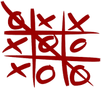
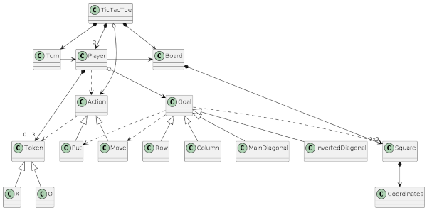
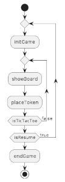
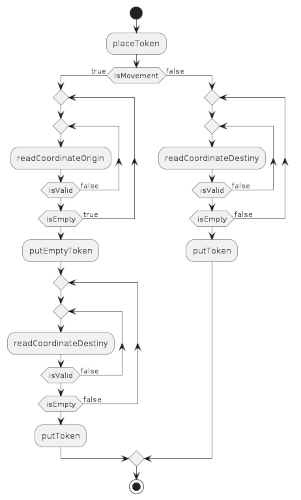
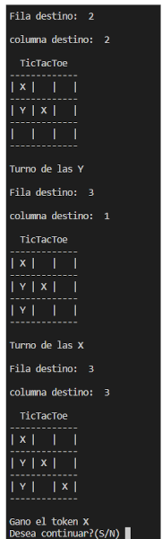

#TicTacToe V0.0

####Development of the popular game, composed of a 3x3 board and 3 tokens per player. [WIKI](https://en.wikipedia.org/wiki/Tic-tac-toe)

Index

- [Technologies](#technologies)
- [Domain Model](#domain-model)
    - [Vocabulary](#vocabulary)
    - [Main sequence](#main-sequence)
    - [Place token function](#place-token-function)
- [Console View](#console-view)

## Technologies

- Javascript on functions
- Views in console

## Domain Model

#### Vocabulary

|  |
| ----------------------------------------- |

#### Main sequence

|  |
| -------------------------------------------- |

#### Place token function

|  |
| ---------------------------------------------- |

 
## Console View

